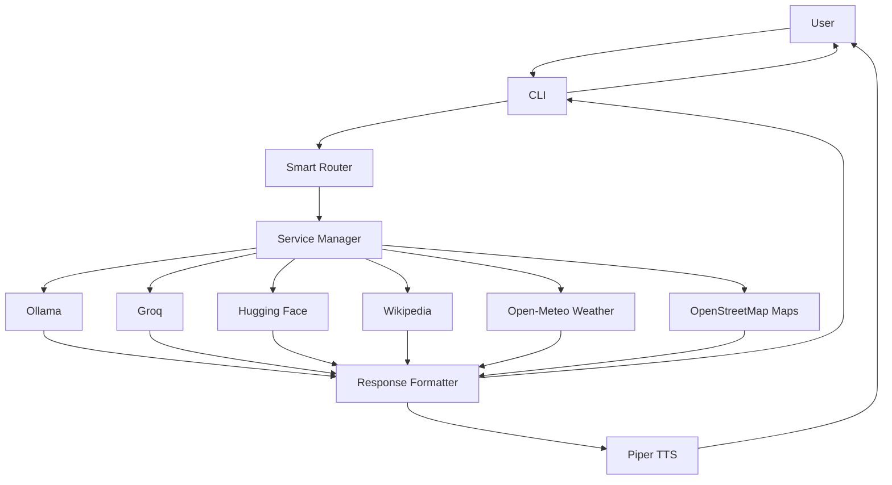
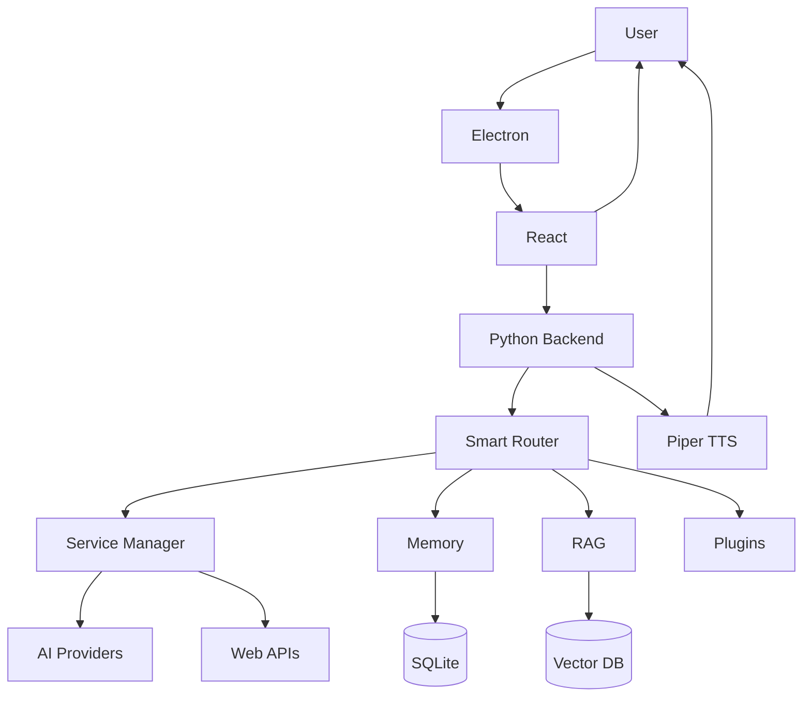

# Architecture Diagram

## Current Architecture

```mermaid
flowchart TD
    U[User] --> CLI[CLI]
    CLI --> SR[Smart Router]
    SR --> SM[Service Manager]
    SM --> O[Ollama]
    SM --> G[Groq]
    SM --> HF[Hugging Face]
    SM --> W[Wikipedia]
    SM --> WE[Open-Meteo Weather]
    SM --> MAP[OpenStreetMap Maps]
    O --> F[Response Formatter]
    G --> F
    HF --> F
    W --> F
    WE --> F
    MAP --> F
    F --> CLI
    F --> P[Piper TTS]
    CLI --> U
    P --> U
```

## Future Architecture

```mermaid
flowchart TD
    U[User] --> E[Electron]
    E --> R[React]
    R --> B[Python Backend]
    B --> SR[Smart Router]
    SR --> SM[Service Manager]
    SR --> MEM[Memory]
    MEM --> SQL[(SQLite)]
    SR --> RAG[RAG]
    RAG --> VDB[(Vector DB)]
    SM --> AI[AI Providers]
    SM --> API[Web APIs]
    SR --> PL[Plugins]
    B --> TTS[Piper TTS]
    R --> U
    TTS --> U
```
