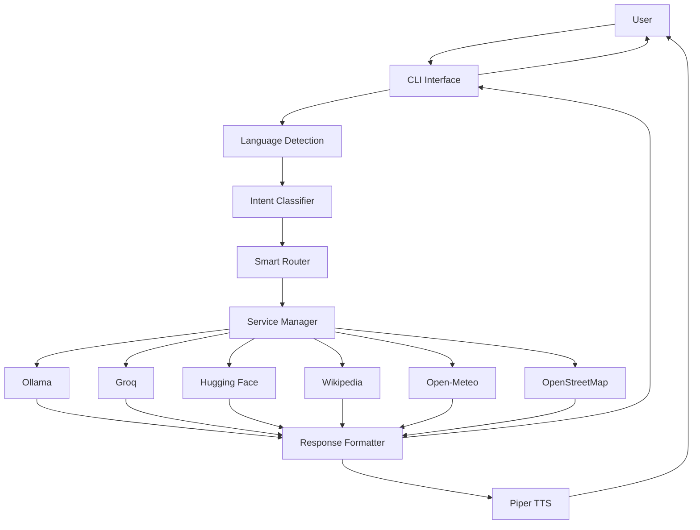

# DFD Level 1 - Current System

```mermaid
flowchart TD
    U[User] --> CLI[CLI Interface]
    CLI --> LD[Language Detection]
    LD --> IC[Intent Classifier]
    IC --> SR[Smart Router]
    SR --> SM[Service Manager]
    SM --> O[Ollama]
    SM --> G[Groq]
    SM --> HF[Hugging Face]
    SM --> W[Wikipedia]
    SM --> OM[Open-Meteo]
    SM --> MAP[OpenStreetMap]
    O --> RF[Response Formatter]
    G --> RF
    HF --> RF
    W --> RF
    OM --> RF
    MAP --> RF
    RF --> CLI
    RF --> TTS[Piper TTS]
    CLI --> U
    TTS --> U
```
