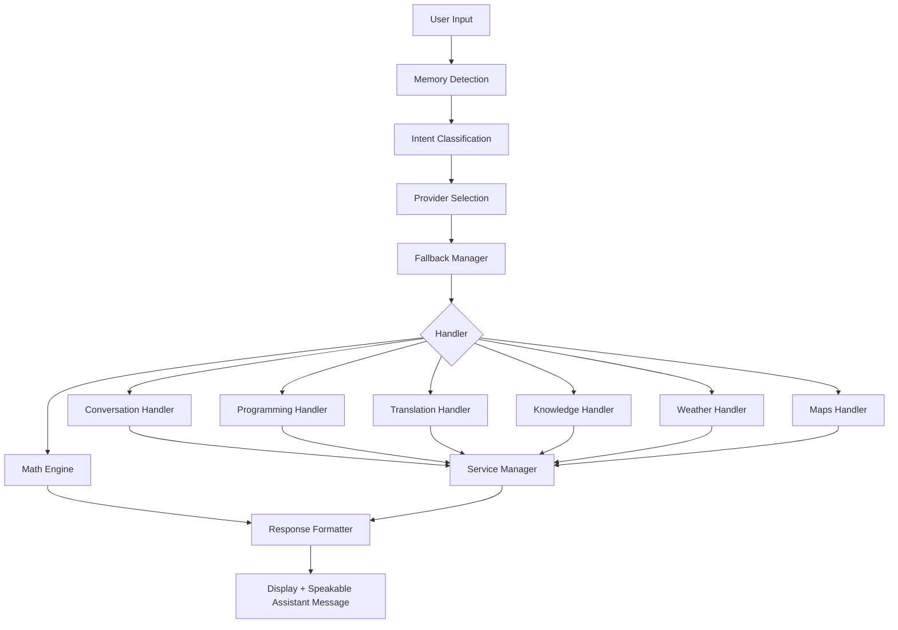

# DFD Level 2 - Smart Router Detail

```mermaid
flowchart TD
    IN[User Input] --> M[Memory Detection]
    M --> IC[Intent Classification]
    IC --> PS[Provider Selection]
    PS --> FB[Fallback Manager]
    FB --> H{Handler}
    H --> C[Conversation Handler]
    H --> P[Programming Handler]
    H --> T[Translation Handler]
    H --> K[Knowledge Handler]
    H --> WE[Weather Handler]
    H --> MA[Maps Handler]
    H --> ME[Math Engine]
    C --> SM[Service Manager]
    P --> SM
    T --> SM
    K --> SM
    WE --> SM
    MA --> SM
    ME --> RF[Response Formatter]
    SM --> RF
    RF --> OUT[Display + Speakable Assistant Message]
```
