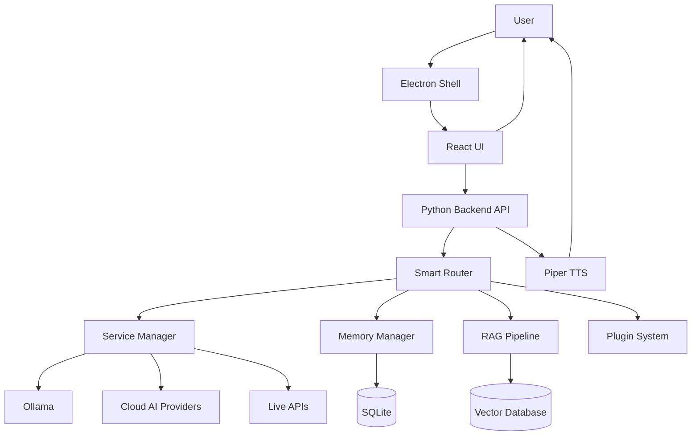

# Future DFD - Desktop Expansion

```mermaid
flowchart TD
    U[User] --> E[Electron Shell]
    E --> R[React UI]
    R --> API[Python Backend API]
    API --> SR[Smart Router]
    SR --> SM[Service Manager]
    SM --> O[Ollama]
    SM --> C[Cloud AI Providers]
    SM --> LIVE[Live APIs]
    SR --> MEM[Memory Manager]
    MEM --> SQL[(SQLite)]
    SR --> RAG[RAG Pipeline]
    RAG --> VDB[(Vector Database)]
    SR --> PLUG[Plugin System]
    API --> TTS[Piper TTS]
    TTS --> U
    R --> U
```
