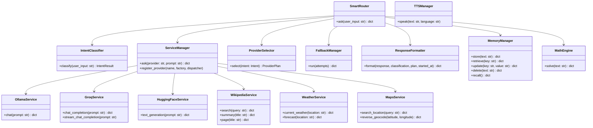

# UML Class Diagram

```mermaid
classDiagram
    class SmartRouter {
        +ask(user_input: str) dict
    }
    class IntentClassifier {
        +classify(user_input: str) IntentResult
    }
    class ServiceManager {
        +ask(provider: str, prompt: str) dict
        +register_provider(name, factory, dispatcher)
    }
    class ProviderSelector {
        +select(intent: Intent) ProviderPlan
    }
    class FallbackManager {
        +run(attempts) dict
    }
    class ResponseFormatter {
        +format(response, classification, plan, started_at) dict
    }
    class OllamaService {
        +chat(prompt: str) dict
    }
    class GroqService {
        +chat_completion(prompt: str) dict
        +stream_chat_completion(prompt: str)
    }
    class HuggingFaceService {
        +text_generation(prompt: str) dict
    }
    class WikipediaService {
        +search(query: str) dict
        +summary(title: str) dict
        +page(title: str) dict
    }
    class WeatherService {
        +current_weather(location: str) dict
        +forecast(location: str) dict
    }
    class MapsService {
        +search_location(query: str) dict
        +reverse_geocode(latitude, longitude) dict
    }
    class TTSManager {
        +speak(text: str, language: str)
    }
    class MemoryManager {
        +store(text: str) dict
        +retrieve(key: str) dict
        +update(key: str, value: str) dict
        +delete(text: str) dict
        +recall() dict
    }
    class MathEngine {
        +solve(text: str) dict
    }

    SmartRouter --> IntentClassifier
    SmartRouter --> ProviderSelector
    SmartRouter --> FallbackManager
    SmartRouter --> ResponseFormatter
    SmartRouter --> ServiceManager
    SmartRouter --> MemoryManager
    SmartRouter --> MathEngine
    ServiceManager --> OllamaService
    ServiceManager --> GroqService
    ServiceManager --> HuggingFaceService
    ServiceManager --> WikipediaService
    ServiceManager --> WeatherService
    ServiceManager --> MapsService
```
