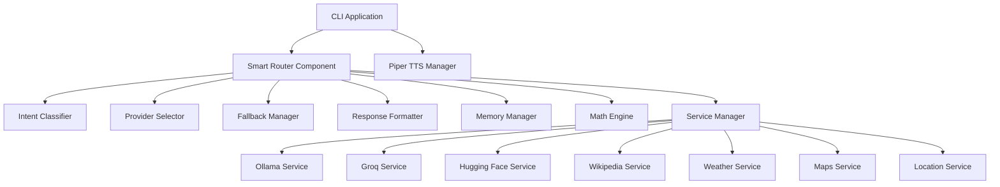

# UML Component Diagram

```mermaid
flowchart TD
    APP[CLI Application] --> ROUTER[Smart Router Component]
    ROUTER --> IC[Intent Classifier]
    ROUTER --> PS[Provider Selector]
    ROUTER --> FB[Fallback Manager]
    ROUTER --> RF[Response Formatter]
    ROUTER --> MM[Memory Manager]
    ROUTER --> ME[Math Engine]
    ROUTER --> SM[Service Manager]
    SM --> OS[Ollama Service]
    SM --> GS[Groq Service]
    SM --> HFS[Hugging Face Service]
    SM --> WS[Wikipedia Service]
    SM --> WES[Weather Service]
    SM --> MS[Maps Service]
    SM --> LS[Location Service]
    APP --> TTS[Piper TTS Manager]
```
