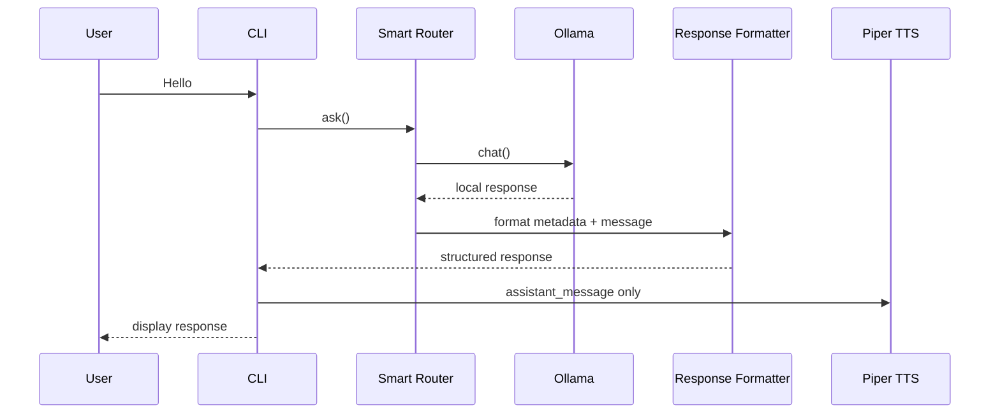
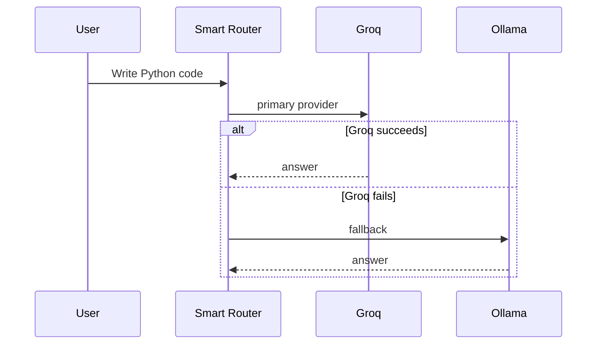
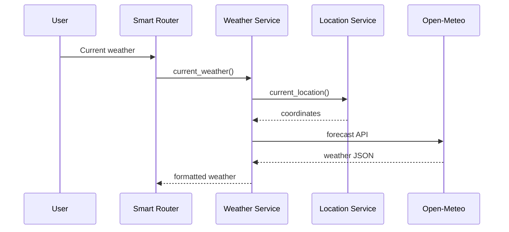
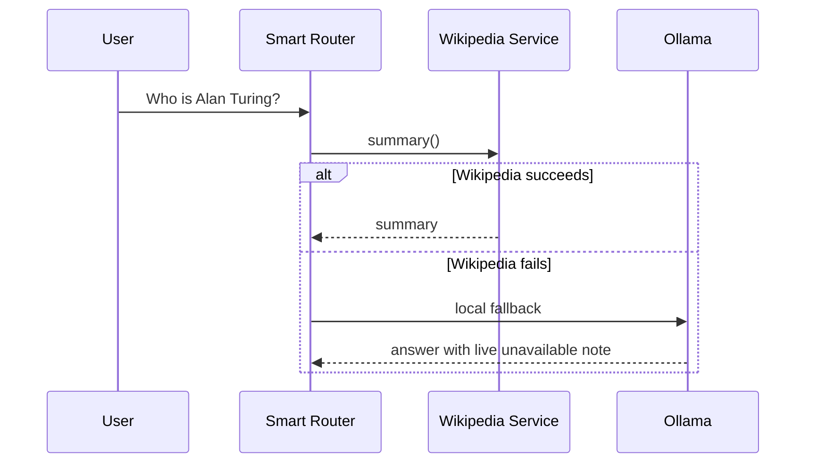
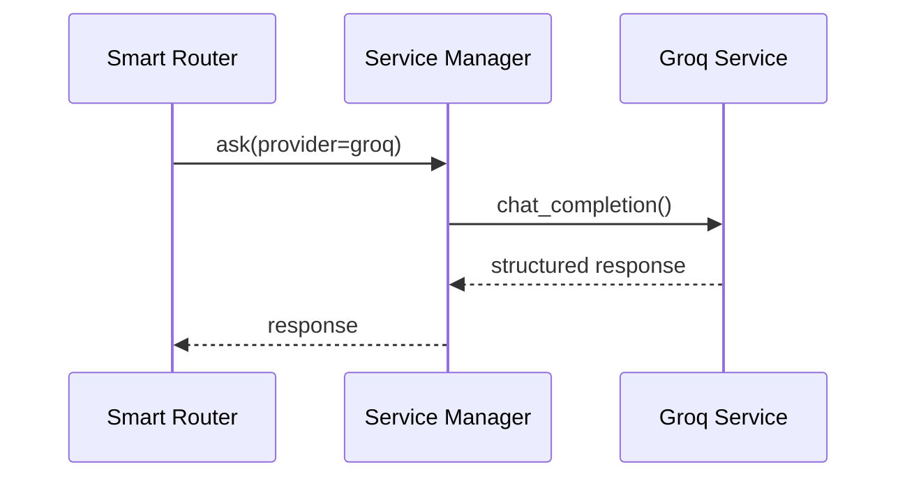
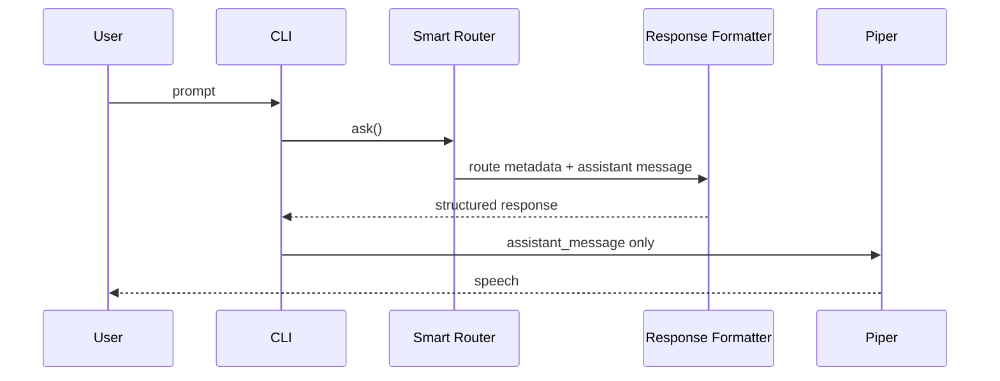

# Sequence Diagrams

## Conversation

```mermaid
sequenceDiagram
    participant U as User
    participant CLI as CLI
    participant SR as Smart Router
    participant O as Ollama
    participant RF as Response Formatter
    participant TTS as Piper TTS
    U->>CLI: Hello
    CLI->>SR: ask()
    SR->>O: chat()
    O-->>SR: local response
    SR->>RF: format metadata + message
    RF-->>CLI: structured response
    CLI->>TTS: assistant_message only
    CLI-->>U: display response
```

## Programming

```mermaid
sequenceDiagram
    participant U as User
    participant SR as Smart Router
    participant G as Groq
    participant O as Ollama
    U->>SR: Write Python code
    SR->>G: primary provider
    alt Groq succeeds
        G-->>SR: answer
    else Groq fails
        SR->>O: fallback
        O-->>SR: answer
    end
```

## Weather

```mermaid
sequenceDiagram
    participant U as User
    participant SR as Smart Router
    participant WS as Weather Service
    participant LS as Location Service
    participant OM as Open-Meteo
    U->>SR: Current weather
    SR->>WS: current_weather()
    WS->>LS: current_location()
    LS-->>WS: coordinates
    WS->>OM: forecast API
    OM-->>WS: weather JSON
    WS-->>SR: formatted weather
```

## Wikipedia

```mermaid
sequenceDiagram
    participant U as User
    participant SR as Smart Router
    participant W as Wikipedia Service
    participant O as Ollama
    U->>SR: Who is Alan Turing?
    SR->>W: summary()
    alt Wikipedia succeeds
        W-->>SR: summary
    else Wikipedia fails
        SR->>O: local fallback
        O-->>SR: answer with live unavailable note
    end
```

## Groq

```mermaid
sequenceDiagram
    participant SR as Smart Router
    participant SM as Service Manager
    participant G as Groq Service
    SR->>SM: ask(provider=groq)
    SM->>G: chat_completion()
    G-->>SM: structured response
    SM-->>SR: response
```

## Voice

```mermaid
sequenceDiagram
    participant U as User
    participant CLI as CLI
    participant SR as Smart Router
    participant RF as Response Formatter
    participant TTS as Piper
    U->>CLI: prompt
    CLI->>SR: ask()
    SR->>RF: route metadata + assistant message
    RF-->>CLI: structured response
    CLI->>TTS: assistant_message only
    TTS-->>U: speech
```
