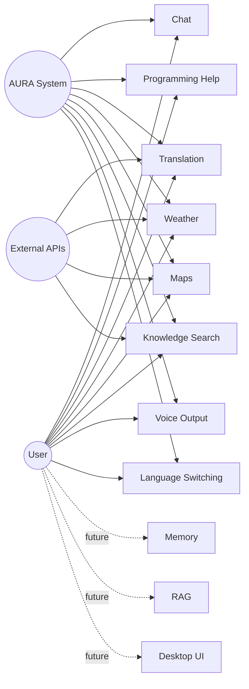

# Use Case Diagram

```mermaid
flowchart LR
    User((User))
    System((AURA System))
    APIs((External APIs))

    User --> Chat[Chat]
    User --> Programming[Programming Help]
    User --> Translation[Translation]
    User --> Weather[Weather]
    User --> Maps[Maps]
    User --> Knowledge[Knowledge Search]
    User --> Voice[Voice Output]
    User --> Language[Language Switching]

    System --> Chat
    System --> Programming
    System --> Translation
    System --> Weather
    System --> Maps
    System --> Knowledge
    System --> Voice
    System --> Language

    APIs --> Translation
    APIs --> Weather
    APIs --> Maps
    APIs --> Knowledge

    User -. future .-> Memory[Memory]
    User -. future .-> RAG[RAG]
    User -. future .-> Desktop[Desktop UI]
```
